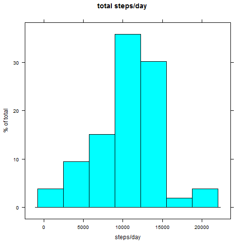
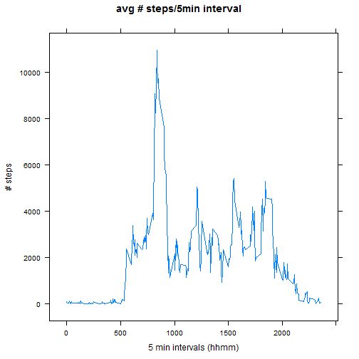
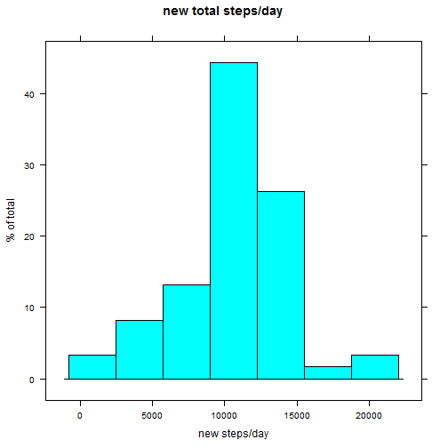
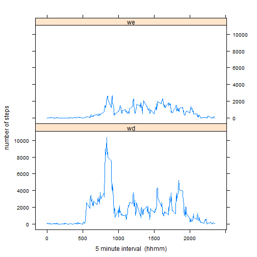

REP DATA ASSIG 1
========================================================


```r
##Loading and preprocessing the data
## Read local data
amd <- read.csv("~/R/repdata1/activity.csv")
#head(amd)
#str(amd)

##sum by day
sumbyday<-aggregate(steps~date, data=amd,FUN=sum)
#sumbyday
##histogram total number of steps each day
library (lattice)
histogram(sumbyday$steps,main="total steps/day",
    xlab="steps/day", ylab="% of total")
```

 

```r
## mean and media total no. steps per day
mean(sumbyday$steps)
```

```
## [1] 10766.19
```

```r
median(sumbyday$steps)
```

```
## [1] 10765
```

```r
##average daily activity pattern
## time series plot 5 minute interval average steps
sum.by.interval<-aggregate(steps~interval, data=amd,FUN=sum)
#head(sum.by.interval)
xyplot(steps~interval,sum.by.interval,type="l",
    main="avg # steps/5min interval",
    xlab="5 min intervals (hhmm)", ylab="# steps")
```

 

```r
## max avg steps interval
max.steps<-max(sum.by.interval$steps)
#max.steps
max.avg.steps.interval <- subset(sum.by.interval,
                            steps == max.steps, 
                            select=c(interval, steps))
max.avg.steps.interval
```

```
##     interval steps
## 104      835 10927
```

```r
## calculate total number of missing values (steps=NA) in dataset
total.missing.values<-sum(is.na(amd$steps))
total.missing.values
```

```
## [1] 2304
```

```r
## fill all missing step values with interval mean 
avg.by.interval<-aggregate(steps~interval, data=amd,FUN=mean)
#avg.by.interval
amd.imputed<-merge(amd,avg.by.interval, by="interval")
#head(amd.imputed)
new.amd<-amd.imputed
#head(new.amd)
new.amd$steps.x[is.na(new.amd$steps.x)]<- amd.imputed$steps.y[is.na(amd.imputed$steps.x)]
new.amd<-new.amd[,1:3]
#head(new.amd,10)

##new dataset sum by day for histogram
new.sumbyday<-aggregate(steps.x~date, data=new.amd,FUN=sum)
#new.sumbyday
##histogram total number of steps each day with imputed values
histogram(new.sumbyday$steps.x,main="new total steps/day",
    xlab="new steps/day", ylab="% of total")
```

 

```r
## mean and media total no. steps per day
mean(new.sumbyday$steps.x)
```

```
## [1] 10766.19
```

```r
median(new.sumbyday$steps.x)
```

```
## [1] 10766.19
```

```r
# imputed values cause median to equal mean

## create factor variable weekday and weekend
new.amd<-new.amd[with(new.amd,order(date)),]
#head(new.amd,10)
date<-as.POSIXlt(new.amd$date)
week.day<-weekdays(date)
#head(week.day,100)
week.end<-ifelse(week.day=="Saturday","we",
                ifelse(week.day=="Sunday","we","wd"))
#head(week.end,2016)
weekday.amd<-data.frame(new.amd,week.day,week.end)
#head(weekday.amd,10)
#str(weekday.amd)

## time series panel plot of steps/interval subset by we and wd 
wd.data <- subset(weekday.amd,week.end=="wd", 
                  select=c(interval,steps.x,date,week.end))
we.data <- subset(weekday.amd,week.end=="we", 
                  select=c(interval,steps.x,date,week.end))
#head(wd.data)
#head(we.data)
interval.wd<-aggregate(steps.x~interval,data=wd.data,FUN=sum)
interval.we<-aggregate(steps.x~interval,data=we.data,FUN=sum)
#head(interval.wd)
#head(interval.we)
we.int.data<-cbind(interval.we,"we")
names(we.int.data) <- c("interval","steps","weekday")
#we.int.data
wd.int.data<-cbind(interval.wd,"wd")
names(wd.int.data) <- c("interval","steps","weekday")
#wd.int.data
interval.data<-rbind(wd.int.data, we.int.data)
#interval.data
xyplot(steps~interval|weekday,interval.data,type="l",layout=c(1,2),
xlab="5 minute interval  (hhmm)", ylab="number of steps")
```

 

```r
###################
```
